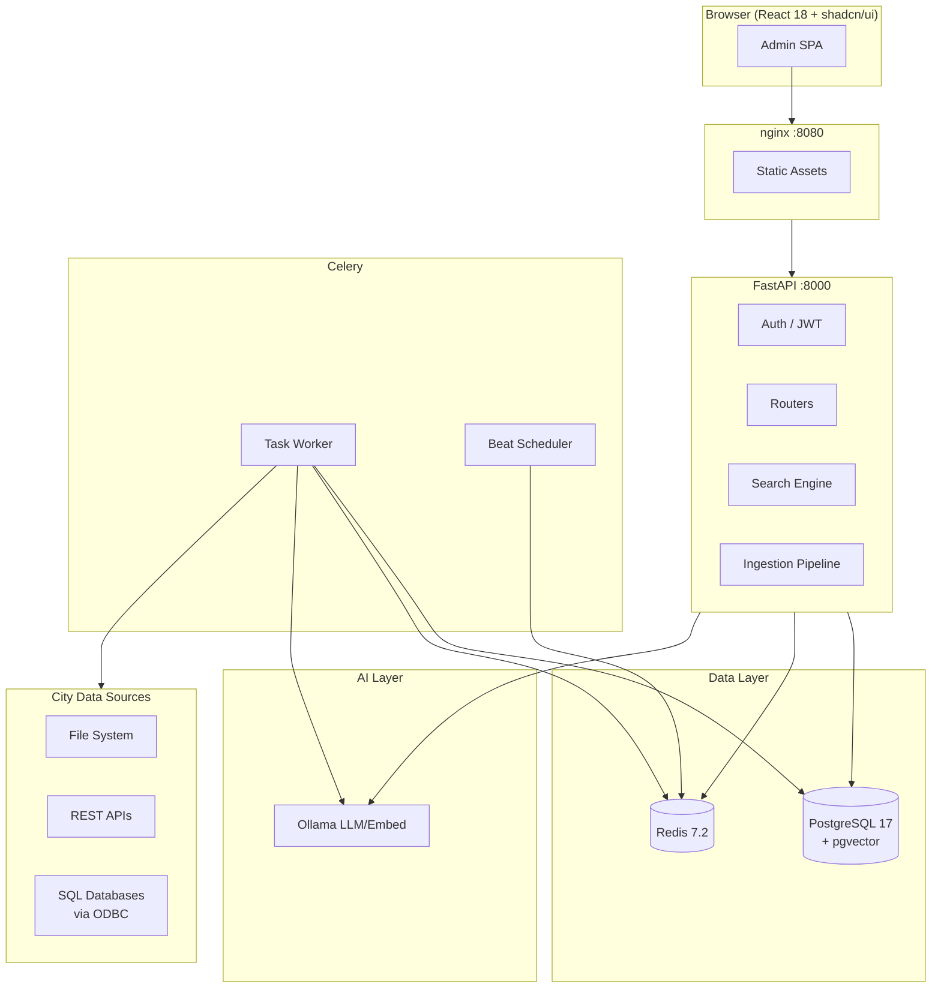
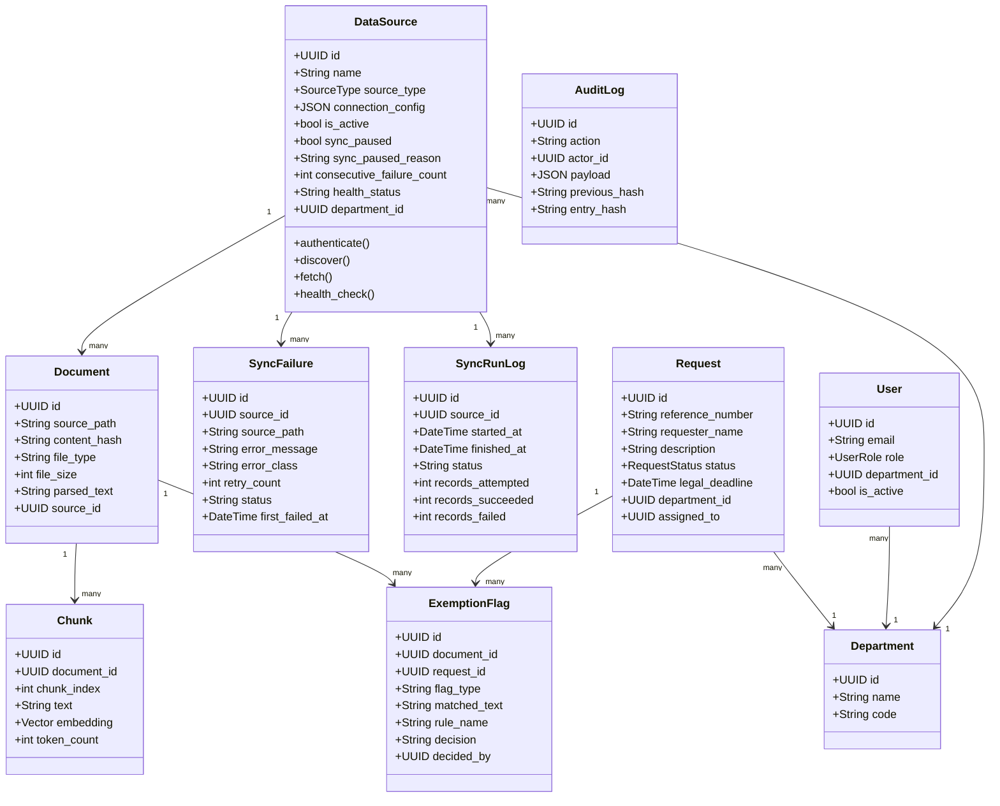
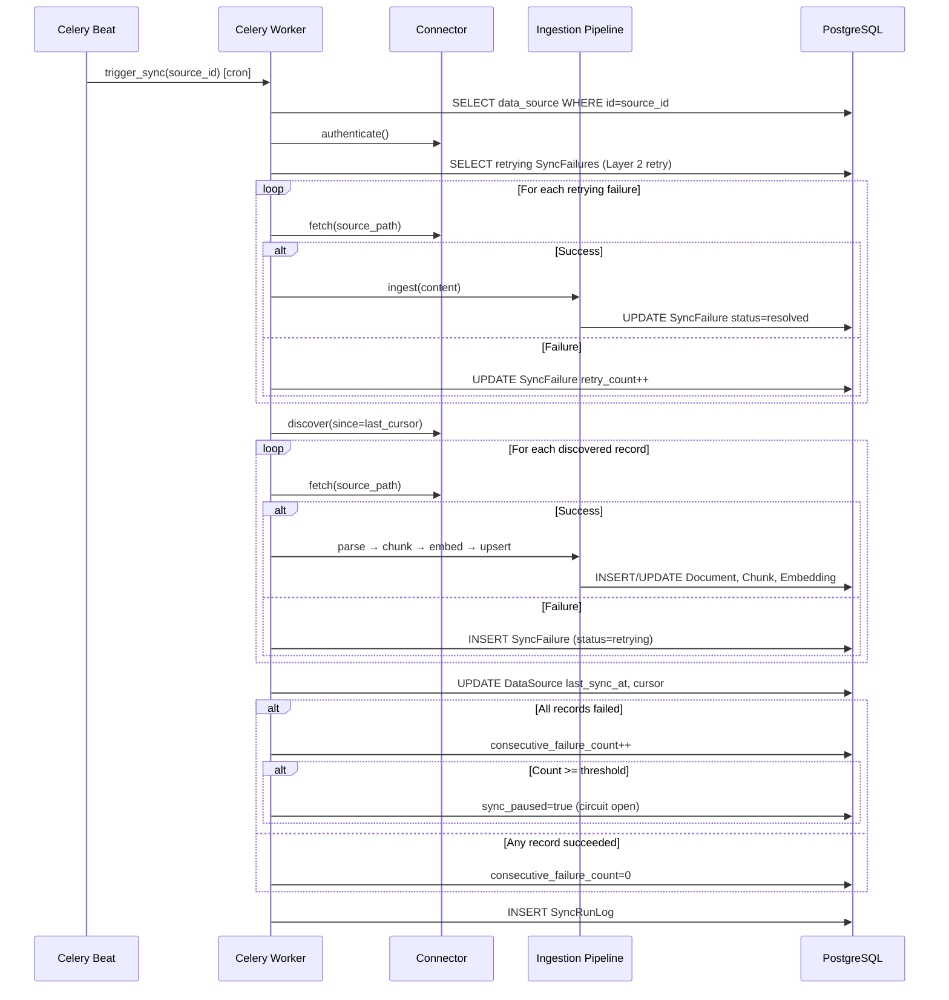
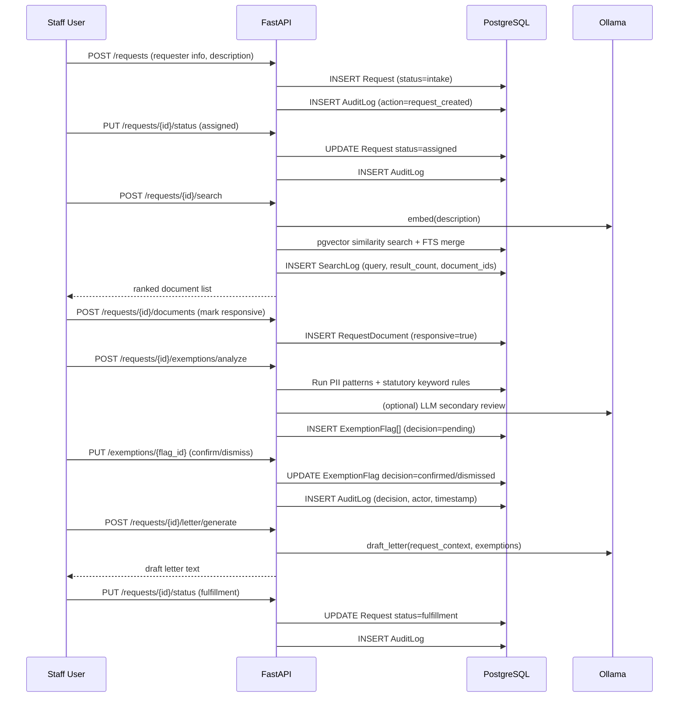
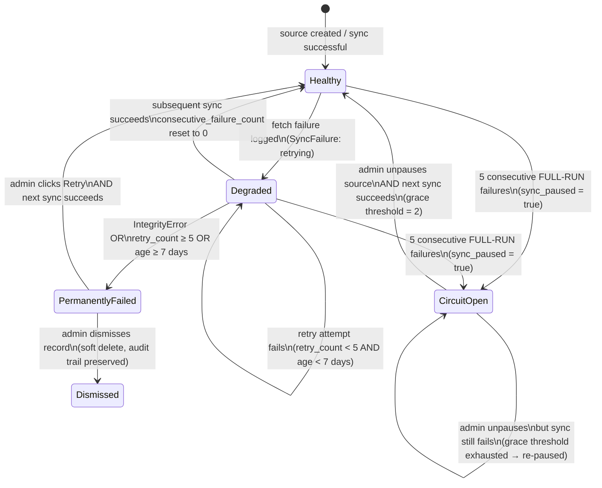
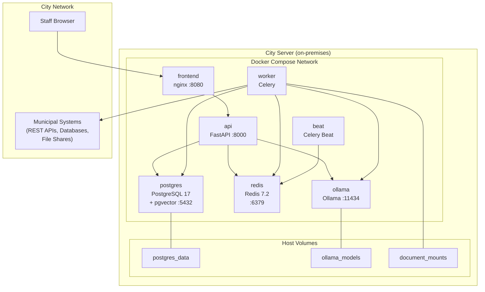

# CivicRecords AI — User Manual

**Version 1.1+ · April 2026**

---

> This manual serves three audiences. Jump to your section:
> - **[Section A — End-User Guide](#section-a--end-user-guide)** — City clerks, records officers, and staff who process requests daily. No technical background required.
> - **[Section B — Technical Reference](#section-b--technical-reference)** — IT administrators, system integrators, and power users who configure and maintain the system.
> - **[Section C — Architectural Reference](#section-c--architectural-reference)** — Developers and architects who need to understand how the system is built and why.

---

# Section A — End-User Guide

*Written for staff who receive, process, and fulfill open records requests. You do not need to understand the technology to use this manual.*

---

## A.1 What Is CivicRecords AI?

CivicRecords AI is a tool your city uses to respond to public records requests — the formal requests that residents, journalists, and attorneys submit asking for government documents.

Before this tool, staff had to search through file shares, email archives, and multiple databases by hand, then review every document one by one to check for sensitive information. That process could take hours or days for a single request.

CivicRecords AI automates the searching, surfaces the most relevant documents, flags information that may be legally protected, and tracks every request from start to finish.

**What you can do with it:**
- Search across all your city's connected documents using plain English questions
- Create and manage records requests from intake through fulfillment
- Review documents flagged for potentially sensitive information (you always make the final call — the system never releases or redacts anything automatically)
- Generate AI-assisted response letters
- Track deadlines and request status in real time

**What it does not do:**
- Release documents without human approval
- Redact information automatically
- Replace your legal judgment — it assists it

---

## A.2 Signing In

1. Open your browser and go to the address your IT department provided (typically `http://[your-city-server]:8080`).
2. Enter your email address and password.
3. Click **Sign In**.

If you cannot sign in, contact your system administrator. Passwords are not stored in this system — your administrator must reset your account.

**Your role determines what you see:**
- **Admin** — Full access: all departments, sources, users, and settings
- **Staff** — Your department's requests and documents only
- **Liaison** — Read-only view of your department's requests

If you see less than you expect, your role or department assignment may need to be updated. Contact your administrator.

---

## A.3 The Dashboard

After signing in, you see the main dashboard. The left sidebar has these sections:

| Section | What it does |
|---|---|
| **Search** | Search all connected city documents |
| **Requests** | Open records request inbox and lifecycle |
| **Sources** | Connected data systems (Admin only) |
| **Exemptions** | Flagged content for human review |
| **Admin** | User accounts, departments, settings |

The top of the screen shows your name, role, and a notification bell for pending items.

---

## A.4 Searching Documents

Search is the fastest way to find documents responsive to a records request.

**To search:**
1. Click **Search** in the left sidebar.
2. Type your question in plain English. For example:
   - *"contracts with Apex Roofing signed after 2022"*
   - *"incident reports from the Riverside District in March 2024"*
   - *"employee termination records for public works department"*
3. Press **Enter** or click **Search**.

**Reading results:**
- Each result shows the document title, the source system it came from, a relevance score, and a text excerpt.
- Click a result to open it.
- The **AI Summary** toggle (if enabled) shows a one-paragraph summary of the document — useful for quickly deciding if it's responsive before opening the full file.

**Filters:**
- Use the date range filter to narrow results by when documents were created or modified.
- Use the source filter to search only specific connected systems.

**Export:**
- Click **Export CSV** to download the result list. The CSV includes document titles, sources, relevance scores, and source paths — useful for documenting your search process in the request record.

---

## A.5 Managing Records Requests

### Creating a New Request

1. Click **Requests** → **New Request**.
2. Fill in the form:
   - **Requester name and contact information**
   - **Request description** — what the requester is asking for
   - **Date received**
   - **Legal deadline** — your jurisdiction's response deadline (e.g., 3 business days for CORA, 5 business days for most state FOIA equivalents)
3. Click **Create Request**.

The request is assigned a reference number and enters the **Intake** status.

### The Request Lifecycle

Requests move through ten statuses. You advance a request manually — the system never skips a status automatically.

| Status | Meaning |
|---|---|
| **Intake** | Request received and logged |
| **Clarification** | Waiting for additional information from the requester |
| **Assigned** | Assigned to a staff member for processing |
| **Search** | Staff is searching for responsive documents |
| **Review** | Documents found; under legal review |
| **Drafting** | Response letter being prepared |
| **Approval** | Waiting for supervisor or legal approval |
| **Fulfillment** | Documents and letter sent to requester |
| **Closure** | Request complete and closed |

To advance a request: open it → click **Advance Status** → select the next status → confirm.

### Searching Within a Request

From inside a request, click **Run Search** to search for responsive documents. The system uses the request description to generate an initial query, which you can edit. Results are saved to the request record for audit purposes.

### Adding Documents to a Request

After searching, mark documents as **Responsive** or **Non-Responsive**. Only documents marked responsive will appear in the response package.

### Request Timeline

Every action on a request is recorded in the **Timeline** tab: who did what, and when. This is your audit trail.

---

## A.6 Exemption Detection and Review

Exemption detection finds content that may be legally protected from release — personal identification numbers, medical information, law enforcement-specific data, and state statutory exemptions.

**Important:** The system flags content for your review. It does not redact or withhold anything. Every flag requires your decision.

### How Flags Work

When the system analyzes a document, it may produce flags:

- **Tier 1 — Pattern matches:** Social Security numbers, credit card numbers, phone numbers, email addresses, bank account numbers, and driver's license formats (all 50 states and DC).
- **Tier 2 — Statutory keywords:** Phrases matching exemption language in your state's open records law (180 rules covering all 50 states and DC).
- **Tier 3 — LLM review (optional):** If enabled, an AI model reviews flagged content and adds context.

### Reviewing a Flag

1. Open the request → click **Exemption Review**.
2. Each flag shows:
   - The flagged text excerpt
   - The exemption rule that triggered it
   - The page or document location
3. Choose:
   - **Confirm** — This information is exempt; do not include it in the release.
   - **Dismiss** — This is not actually sensitive; include it in the release.
   - **Escalate** — Flag for legal review before deciding.

All decisions are recorded with a timestamp and your name.

---

## A.7 Response Letters

CivicRecords AI can draft a response letter for each request.

1. Open a request in **Drafting** status.
2. Click **Generate Draft Letter**.
3. The system creates a draft using the request details, the documents being released, and any exemptions confirmed.
4. Edit the draft as needed — the AI output is a starting point, not a final document.
5. Click **Save Letter** to attach it to the request record.

All generated letters include an **AI Content Disclosure** statement as required by the Colorado AI Act (CAIA) and similar state regulations. Do not remove this disclosure.

---

## A.8 Fees

If your jurisdiction charges fees for records requests:

1. Open the request → click the **Fees** tab.
2. Enter fee line items (search time, copying, etc.).
3. Record payment when received.
4. The system tracks outstanding fees and can include a fee statement in the response letter.

---

## A.9 Common Questions

**Q: I can't find a document I know exists.**
The document may not be connected to the system yet. Check with your administrator which systems are currently synced. If the system is connected but a document is missing, try a different search phrase — the AI search engine matches on meaning, not just exact words.

**Q: A flag was triggered on a document that clearly isn't sensitive.**
Click **Dismiss** on that flag. The system learns nothing from your dismissal — it only records your decision in the audit log.

**Q: I advanced a request to the wrong status.**
Contact your administrator. Status changes are logged and can be manually corrected with an admin account. There is no automatic "back" button — the audit trail must remain intact.

**Q: The deadline passed and the request is still open.**
Overdue requests appear with a red deadline indicator. You can still process them normally. Document the delay in the request timeline.

**Q: I see a "Circuit Open" or "Paused" badge on a data source.**
This means the system lost connection to that data source after repeated failures. Contact your IT administrator. You can still search documents that were previously synced — only new documents from that source will be missing.

---

## A.10 Glossary

| Term | Plain English meaning |
|---|---|
| **Open records request** | A formal request from a member of the public for government documents. Also called FOIA, CORA, or your state's equivalent. |
| **Exemption** | A legal reason why certain information does not have to be released. Examples: Social Security numbers, active criminal investigation details, attorney-client communications. |
| **PII** | Personal Identifiable Information — data that could identify a specific person, like a Social Security number or home address. |
| **Responsive document** | A document that directly answers what the requester asked for. |
| **Data source** | A connected system that CivicRecords AI can search — a file folder, database, or web API. |
| **Ingestion / Sync** | The process of reading documents from a data source and making them searchable. |
| **Redaction** | Blacking out exempt information before releasing a document. CivicRecords AI flags candidates; staff perform the actual redaction. |
| **Audit log** | A permanent, tamper-evident record of every action taken in the system. Required for legal compliance. |
| **Circuit breaker** | A safety feature that pauses syncing from a data source if it fails repeatedly, preventing runaway errors. |
| **AI Summary** | A short paragraph generated by the AI describing what a document contains. Used to quickly assess relevance — not a legal summary. |

---

---

# Section B — Technical Reference

*For IT administrators, system integrators, and power users who install, configure, and maintain CivicRecords AI.*

---

## B.1 System Requirements

| Component | Minimum | Recommended |
|---|---|---|
| CPU | 8 cores | 16 cores |
| RAM | 32 GB | 64 GB |
| Disk | 50 GB free | 2+ TB NVMe |
| OS | Windows 10/11, macOS 13+, Ubuntu 22.04+, Debian 12+ | Ubuntu 22.04 LTS |
| Runtime | Docker Desktop (Windows/macOS) or Docker Engine (Linux) | Docker Engine 24+ |

**GPU (optional but recommended):**
- NVIDIA (CUDA) — Windows and Linux
- AMD (ROCm) — Linux only
- AMD/Intel (DirectML) — Windows
- CPU fallback is supported but significantly slower for LLM inference

---

## B.2 Installation

> **Current install path — script-based setup scripts.** The scripts below configure and launch the Docker Compose stack. They do not install Docker Desktop, Docker Engine, WSL, or any other system prerequisite — those must be present before the scripts run. If Docker is not installed, the scripts will fail with a clear error and you must install Docker manually before retrying.
>
> **Planned — T5E (full-spectrum installer):** A future release will provide a downloadable guided installer that checks hardware compatibility, installs Docker and WSL where needed, verifies Ollama and Gemma 4 viability, and produces a truthful ready/not-ready result before claiming the system is operational. Until T5E ships, this script-based path is the only supported install method.

**Before you begin — prerequisites:**

1. Install **Docker Desktop** (Windows 10/11 or macOS 13+): [docker.com/get-started](https://www.docker.com/get-started)
   *Linux:* Install **Docker Engine** 24+ and Docker Compose v2.
2. Ensure Docker is running (you should see the Docker icon in your taskbar/menu bar, or `docker info` returns without error).
3. Confirm system requirements: 8+ CPU cores, 32 GB RAM, 50 GB free disk.

**Windows:**
```powershell
git clone https://github.com/scottconverse/civicrecords-ai.git
cd civicrecords-ai
.\install.ps1
```

**macOS / Linux:**
```bash
git clone https://github.com/scottconverse/civicrecords-ai.git
cd civicrecords-ai
bash install.sh
```

The installer:
1. Creates `.env` from `.env.example` (prompts for required values)
2. Pulls Docker images (~8–12 GB first time)
3. Pulls the Ollama model (`nomic-embed-text` always; `gemma4` or your configured model)
4. Starts all 7 Docker Compose services
5. Runs database migrations
6. Creates the initial admin account

After installation, open `http://localhost:8080` in your browser.

---

## B.3 Environment Variables

All configuration lives in `.env` in the repo root. Never commit this file.

| Variable | Required | Default | Description |
|---|---|---|---|
| `DATABASE_URL` | Yes | — | PostgreSQL connection string (asyncpg format) |
| `JWT_SECRET` | Yes | — | Random string ≥ 32 chars for JWT signing |
| `FIRST_ADMIN_EMAIL` | Yes | — | Initial admin account email |
| `FIRST_ADMIN_PASSWORD` | Yes | — | Initial admin account password |
| `OLLAMA_BASE_URL` | No | `http://ollama:11434` | Ollama API endpoint |
| `REDIS_URL` | No | `redis://redis:6379/0` | Redis connection string |
| `SMTP_HOST` | No | — | SMTP server for email notifications |
| `SMTP_PORT` | No | `587` | SMTP port |
| `SMTP_USERNAME` | No | — | SMTP auth username |
| `SMTP_PASSWORD` | No | — | SMTP auth password |
| `AUDIT_RETENTION_DAYS` | No | `1095` | Audit log retention (3 years default) |

---

## B.4 Docker Services

Seven services run via Docker Compose:

| Service | Image | Port | Role |
|---|---|---|---|
| `postgres` | postgres:17 + pgvector | 5432 | Primary database + vector store |
| `redis` | redis:7.2 | 6379 | Celery broker and result backend |
| `ollama` | ollama/ollama | 11434 | Local LLM inference |
| `api` | civicrecords-ai/api | 8000 | FastAPI backend |
| `worker` | civicrecords-ai/api | — | Celery async task worker |
| `beat` | civicrecords-ai/api | — | Celery beat scheduler |
| `frontend` | civicrecords-ai/frontend | 8080 | nginx + React SPA |

**Common operations:**
```bash
# Start all services
docker compose up -d

# Stop all services
docker compose down

# View logs
docker compose logs -f api
docker compose logs -f worker

# Run database migrations manually
docker compose exec api alembic upgrade head

# Restart a single service
docker compose restart worker
```

---

## B.5 Connector Types and Configuration

CivicRecords AI uses a standardized connector framework. Each connector must implement: `authenticate()`, `discover()`, `fetch()`, and `health_check()`.

### B.5.1 File System Connector

Reads files from a local or network-mounted directory.

```json
{
  "source_type": "file_system",
  "connection_config": {
    "path": "/mnt/city-documents"
  }
}
```

| Field | Description |
|---|---|
| `path` | Absolute path visible to the Docker container (local dir or network mount) |

**Supported file types:** PDF, DOCX, XLSX, CSV, TXT, HTML, EML. Scanned PDFs processed via Gemma 4 multimodal + Tesseract OCR fallback.

### B.5.2 Manual Drop Connector

Watches a drop folder for files uploaded manually by staff. Use when a system has no API and staff exports files by hand.

```json
{
  "source_type": "manual_drop",
  "connection_config": {
    "drop_path": "/mnt/drop/incoming"
  }
}
```

| Field | Description |
|---|---|
| `drop_path` | Directory the connector watches for new files |

**Workflow:** Staff places exported files in the drop folder. On each sync, the connector ingests any files not yet processed, then leaves them in place (files are never deleted).

### B.5.3 REST API Connector

Connects to any REST API that returns JSON, XML, or CSV.

```json
{
  "source_type": "rest_api",
  "connection_config": {
    "base_url": "https://api.tyler-munis.example.gov",
    "endpoint_path": "/v1/contracts",
    "auth_method": "api_key",
    "key_header": "X-API-Key",
    "key_location": "header",
    "api_key": "your-api-key-here",
    "pagination_style": "page",
    "page_param": "page",
    "limit_param": "per_page",
    "page_size": 100,
    "results_field": "data",
    "id_field": "id",
    "response_format": "json",
    "max_records": 50000,
    "max_response_bytes": 10485760
  }
}
```

**Auth methods:** `none`, `api_key` (header or query), `bearer`, `oauth2` (client credentials), `basic`

**Pagination styles:** `none`, `page`, `offset`, `cursor`

**OAuth2 configuration:**
```json
{
  "auth_method": "oauth2",
  "token_url": "https://auth.example.gov/token",
  "client_id": "your-client-id",
  "client_secret": "your-client-secret"
}
```

**Rate limiting:** The connector honors `Retry-After` response headers, sleeping up to 600 seconds before retrying (D10 spec). Malformed headers fall back to exponential backoff.

### B.5.4 ODBC Connector

Connects to SQL databases via pyodbc (SQL Server, MySQL, PostgreSQL, Oracle, SQLite).

```json
{
  "source_type": "odbc",
  "connection_config": {
    "connection_string": "DRIVER={ODBC Driver 17 for SQL Server};Server=10.0.1.5;Database=TylerNewWorld;UID=readonly_user;PWD=password",
    "table_name": "documents",
    "pk_column": "id",
    "modified_column": "updated_at",
    "batch_size": 500
  }
}
```

| Field | Description |
|---|---|
| `connection_string` | Full ODBC connection string (never logged or echoed) |
| `table_name` | Table to ingest. Each row becomes one document. |
| `pk_column` | Primary key column for deduplication |
| `modified_column` | Optional timestamp column — used for incremental sync |
| `batch_size` | Rows fetched per query (default 500) |

**Security:** Only `SELECT` queries are issued. `table_name` and `pk_column` are validated against a safe-identifier pattern — SQL injection via those fields is blocked at schema validation time.

---

## B.6 Scheduled Sync

Each data source can be synced on a schedule using standard 5-field cron expressions.

```
┌───────────── minute (0–59)
│ ┌───────────── hour (0–23)
│ │ ┌───────────── day of month (1–31)
│ │ │ ┌───────────── month (1–12)
│ │ │ │ ┌───────────── day of week (0–6, Sunday=0)
│ │ │ │ │
0 2 * * *     # Every day at 2:00 AM UTC
*/30 * * * *  # Every 30 minutes
0 */6 * * *   # Every 6 hours
```

**Constraints:**
- Minimum interval: 5 minutes (enforced by validation)
- Minimum re-run interval: 7 days rolling window (prevents accidentally-tight schedules)
- All schedules are evaluated in UTC; the UI shows your local timezone for reference
- Set `schedule_enabled = false` to pause scheduling without clearing the schedule expression

---

## B.7 Sync Failure Tracking and Circuit Breaker

### Failure States

Individual records track their own failure state:

| Status | Meaning |
|---|---|
| `retrying` | Failed at least once; will retry on next sync |
| `permanently_failed` | Failed ≥ 5 times or is ≥ 7 days old; no longer retried automatically |
| `resolved` | Was failing; successfully ingested on a later sync |
| `tombstone` | Admin-dismissed; excluded from future syncs |

### Circuit Breaker

The circuit breaker tracks *full-run* failures — when every single record in a sync run fails.

- After **5 consecutive full-run failures**: source is auto-paused (`sync_paused = true`), admin is notified, health status shows **Circuit Open**
- To recover: fix the underlying issue → click **Unpause →** on the source card
- After unpausing: the source enters **grace period** (threshold = 2 consecutive full-run failures to re-trip). This gives fast feedback if the fix didn't work.
- A successful sync after unpausing resets the threshold to normal (5)

### Health Status

Each source card shows a colored health indicator:

| Color | Status | Meaning |
|---|---|---|
| 🟢 Green | Healthy | Syncing normally |
| 🟡 Amber | Degraded | Some record failures, but sync is running |
| 🔴 Red | Paused | Circuit open; manual intervention required |

### Failed Records Panel

Click **View failures** on any source card with failures to open the panel:
- See each failed record's path, error message, retry count, and status
- **Retry** individual records or use **Retry all permanently failed** for bulk retry
- **Dismiss** records you don't want ingested (adds a tombstone; preserved in audit log)

---

## B.8 API Reference

The FastAPI backend exposes a REST API documented at `http://localhost:8000/docs` (Swagger UI) and `http://localhost:8000/redoc`.

**Authentication:** All endpoints require a JWT bearer token.

```bash
# Obtain a token
curl -X POST http://localhost:8000/auth/login \
  -H "Content-Type: application/json" \
  -d '{"email": "admin@example.gov", "password": "yourpassword"}'

# Use the token
curl http://localhost:8000/datasources \
  -H "Authorization: Bearer <token>"
```

**Key endpoint groups:**

| Prefix | Description |
|---|---|
| `/auth/` | Login, token refresh, password management |
| `/datasources/` | CRUD for data sources, sync triggers, failure management |
| `/documents/` | Document search, retrieval, export |
| `/requests/` | Records request lifecycle |
| `/exemptions/` | Flag review and management |
| `/admin/` | Users, departments, model registry |
| `/compliance/` | Compliance templates download |
| `/health` | Service health check |

**Service accounts:** Create dedicated API accounts with limited roles for programmatic access (e.g., a requester portal integration). Manage in Admin → Service Accounts.

---

## B.9 Model Registry

CivicRecords AI uses two model types:

| Type | Default | Notes |
|---|---|---|
| **Embedding** | `nomic-embed-text` | Always required; very lightweight |
| **Chat/Vision** | `gemma4:27b` (recommended) | Used for document analysis, AI summaries, and OCR on scanned PDFs |

**To change models:**
1. Go to **Admin → Model Registry**
2. Select the model type
3. Enter the Ollama model identifier (e.g., `mistral:7b`, `llama3:8b`)
4. Click **Save** — the change takes effect on the next task that requires that model

**To pull a new model:**
```bash
docker compose exec ollama ollama pull gemma4:27b
```

---

## B.10 Backup and Maintenance

**Database backup:**
```bash
docker compose exec postgres pg_dump -U civicrecords civicrecords | gzip > backup_$(date +%Y%m%d).sql.gz
```

**Restore:**
```bash
gunzip -c backup_20260101.sql.gz | docker compose exec -T postgres psql -U civicrecords civicrecords
```

**Disk space:** Document content and embeddings grow with your document set. Monitor with:
```bash
docker compose exec postgres psql -U civicrecords -c "SELECT pg_size_pretty(pg_database_size('civicrecords'));"
```

**Audit log retention:** Set `AUDIT_RETENTION_DAYS` in `.env`. Default is 1095 (3 years). A Celery beat task trims old records nightly.

**Data sovereignty verification:**
```bash
# Linux/macOS
bash scripts/verify-sovereignty.sh

# Windows
.\scripts\verify-sovereignty.ps1
```
Runs netstat and confirms no outbound connections are active. Present output to your network security team.

---

## B.11 Troubleshooting

**Services won't start:**
```bash
docker compose logs postgres   # Check DB initialization
docker compose logs ollama     # Check model download
docker compose ps              # Check which services are unhealthy
```

**API returns 500:**
```bash
docker compose logs api --tail=50
```

**Worker not processing tasks:**
```bash
docker compose logs worker --tail=50
docker compose restart worker
```

**Ollama model not found:**
```bash
docker compose exec ollama ollama list       # See installed models
docker compose exec ollama ollama pull gemma4:27b  # Pull if missing
```

**Frontend shows blank page:**
Check browser console for errors. Most common cause: API is unreachable. Verify `docker compose ps` shows `api` as healthy.

**Database migration failed:**
```bash
docker compose exec api alembic current     # See current revision
docker compose exec api alembic history     # See migration history
docker compose exec api alembic upgrade head  # Rerun migrations
```

---

---

# Section C — Architectural Reference

*For developers and architects who need to understand the system's structure, data flow, and design decisions.*

---

## C.1 System Overview

CivicRecords AI runs as seven Docker Compose services communicating over an internal Docker network. All data stays on the host machine — no external dependencies after initial setup.



**Design principles:**
- **Local-first:** All inference, storage, and processing on-premises. No cloud calls.
- **Human-in-the-loop:** No automatic releases, redactions, or status advances.
- **Audit by default:** Every state change writes an immutable audit log entry.
- **Idempotent ingestion:** Re-syncing the same document is safe; deduplication prevents duplicates.

---

## C.2 Data Model



**Key design decisions:**
- **Content hash deduplication:** Documents are keyed by `source_path` for structured connectors (REST API, ODBC) and by `content_hash` for binary files. Re-syncing an unchanged document is a no-op.
- **Chunk + Embedding:** Each document is split into ~512-token chunks. Each chunk has its own pgvector embedding. Search queries both the vector index and PostgreSQL full-text index, then merges with reciprocal rank fusion.
- **Hash-chained audit log:** Each `AuditLog` row includes the SHA-256 hash of the previous row. Tamper detection is O(n) chain verification.

---

## C.3 Ingestion Pipeline



**Two-layer retry:**
- **Layer 1 (task-level):** The Celery task uses exponential backoff with jitter for transient connection errors (handled by `with_retry()` in `retry.py`).
- **Layer 2 (record-level):** Individual record failures are persisted as `SyncFailure` rows and retried on subsequent sync ticks, up to 5 retries over 7 days.

**Idempotency contract:**
- Structured records (REST API, ODBC): keyed by `source_path`. Same path → UPDATE in-place, chunks and embeddings replaced atomically.
- Binary records (filesystem): keyed by `content_hash`. Same hash → no-op.
- Race conditions: `SELECT FOR UPDATE` on the document row + partial unique indexes prevent duplicate inserts under concurrent workers.

---

## C.4 Records Request Lifecycle



**Human-in-the-loop enforcement:** The API refuses status transitions that skip required steps. A request cannot move from `intake` directly to `fulfillment` — every intermediate status must be visited. This is enforced at the API layer, not just the UI.

---

## C.5 Sync Failure and Circuit Breaker State Machine



**Grace period implementation:** When an admin clicks **Unpause →**, the database column `sync_paused_reason` is set to `"grace_period"`. The sync runner reads this value and uses threshold=2 instead of threshold=5 for the next sync run. On successful sync, the sentinel is cleared. This provides fast feedback: if the underlying problem wasn't actually fixed, the circuit trips again after just 2 failures.

---

## C.6 Deployment Topology



**Network isolation:** The Docker Compose network is internal. Only `frontend` (:8080) and `api` (:8000) are exposed to the host network. All inter-service communication is internal. No service initiates outbound internet connections after initial setup.

---

## C.7 Search Architecture

Hybrid search combines two retrieval strategies and merges them with reciprocal rank fusion:

```
User Query
    │
    ├──► Semantic Search (pgvector)
    │    Embed query → cosine similarity against Chunk.embedding
    │    Returns: top-K chunks with similarity scores
    │
    └──► Keyword Search (PostgreSQL FTS)
         to_tsquery(query) → ts_rank against Document.fts_vector
         Returns: top-K documents with rank scores
         │
         ▼
    Reciprocal Rank Fusion
    score = Σ 1/(k + rank_i) for each result list
         │
         ▼
    Deduplicate → Normalize scores 0–1
         │
         ▼
    Optional: LLM Summary Generation (Ollama)
         │
         ▼
    Return: ranked DocumentResult[] with source attribution
```

**Normalization:** Scores are normalized to [0, 1] within each result set before fusion, so semantic and keyword results are weighted equally regardless of their native score scales.

**Source attribution:** Every result includes the originating `DataSource`, `source_path`, and `Document.id` for full traceability.

---

## C.8 Security Architecture

**Authentication:** JWT tokens with configurable expiry. Tokens are signed with `JWT_SECRET` using HS256. Refresh tokens are stored in Redis with revocation support.

**Authorization:** Role-based access control enforced at the API layer (FastAPI dependency injection):
- `require_role(UserRole.ADMIN)` — admin-only endpoints
- `require_role(UserRole.STAFF)` — staff and above
- Department scoping injected via `get_current_user()` — all queries are automatically filtered to the user's department

**Audit log integrity:** Each audit entry includes the SHA-256 hash of the previous entry (`previous_hash`). Full chain verification can detect any tampering. The chain can be verified with:
```bash
docker compose exec api python -m app.audit.verify_chain
```

**SQL injection prevention:** ODBC connector queries are validated against an allowlist pattern before execution. No user input is ever interpolated into query strings.

**No secrets in code:** All credentials live in `.env` (gitignored). The `verify-sovereignty.sh` script confirms no outbound connections.

---

## C.9 Key Architectural Decisions

| Decision | Choice | Rationale |
|---|---|---|
| LLM runtime | Ollama (local) | Data sovereignty requirement; no resident data leaves the network |
| Vector store | pgvector (PostgreSQL extension) | Eliminates a separate vector database service; transactions span relational + vector data atomically |
| Task queue | Celery + Redis | Mature, well-understood; supports scheduled sync (beat) and async ingestion |
| Frontend | React 18 + shadcn/ui | Accessible component primitives; civic design tokens; TypeScript strict mode |
| Audit log | Hash-chained PostgreSQL table | Tamper-evident without external dependencies; meets CAIA and state compliance requirements |
| Connector protocol | authenticate/discover/fetch/health_check | Standard interface enables adding new source types without changing ingestion pipeline |
| Embedding model | nomic-embed-text | High quality, small footprint (2 GB), runs on CPU if no GPU present |
| OCR strategy | Gemma 4 multimodal primary, Tesseract fallback | Handles handwritten and low-quality scans; Tesseract as CPU-safe fallback |

---

*End of User Manual — CivicRecords AI v1.1+ · April 2026*
